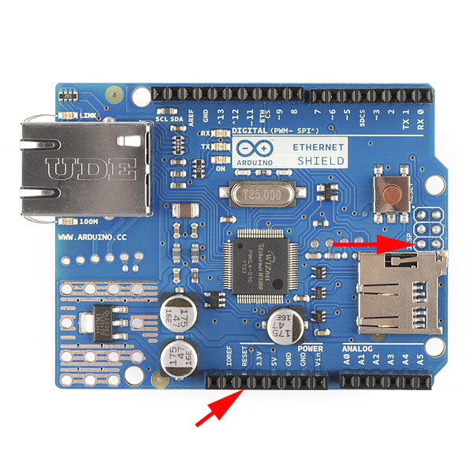

# W5x00 Chip Reset

## Issue

Sometimes Arduino is running fine for days but after power-up or brief loss of power (caused for example by undervoltage), ethernet connection is lost. Ethernet connection is restored only after you press the RST button on the ethernet shield. The issue has been identified and described in detail by the community for example [here](https://chrisramsay.co.uk/posts/2015/08/some-fun-with-a-cloned-arduino-and-w5100-ethernet-shield/), [here](https://www.youtube.com/watch?v=9ZBeprOqC3w), [here](http://tigawd.blogspot.com/2015/05/arduino-uno-clone-and-w5100-ethernet.html) and also [here](https://www.hobbyist.co.nz/?q=ethernet-shield-w5100).

## Cause

Arduino ethernet shields use HW method to reset / initialize the W5x00 chip. They have the W5x00's RST pin hard wired to Arduino's RST pin. If Arduino is reset, the W5x00 should be reset also. However, normal reset time of the Arduino is too short. The Arduino microcontroller has a 65 millisecond powerup/reset delay (the longest available to be set by the fuses and bootloader) but the W5x00 chip expects longer pull-down of the RST pin. As a result, the W5x00 chip fails to reset (and initialize) properly.

The problem is poor ethernet shield design. This issue is not specific to cheap ethernet shields (clones), but exists in all variant of the Arduino Ethernet shields.

## Solution

You can find different solutions on the internet - most of them require soldering additional capacitor (and resistor) to the Arduino Ethernet shield. However, there is much easier and more elegant solution: use SW method to reset / initialize the W5x00 chip.

#### 1. Cut the connection between W5x00's RST pin and Arduino's RST pin.

Keep in mind that there are actually 2 connections between W5x00's RST pin and Arduino's RST pin. You need to cut both of them, simply by bending appropriate pins:

- **Bend the RESET pin on the Ethernet shield.**
- **Bend one pin within the ICSP connector on the Arduino board** (see below)



#### 2. Connect W5x00's RST pin to an unused Arduino pin 7

Attach the ethernet shield to the Arduino board. Use wire (male/male jumper wire) to connect RESET pin and pin 7 on the Ethernet shield.

#### 3. Reset the W5x00 chip programmatically

Within your Arduino sketch, pull down pin 7 to reset (initialize) the W5x00 chip. Since the HW method to reset the W5x00 chip will no longer work (W5x00 will not reset/initialize automatically after power up), you **++must++** pull down pin 7 before calling Ethernet.begin().

If you are using one of my Arduino projects ([Modbus RTU ⇒ Modbus TCP/UDP Gateway](https://github.com/budulinek/arduino-modbus-rtu-tcp-gateway), [Arduino Sensors UDP Gateway](https://github.com/budulinek/arduino-sensors-udp-gateway) or [Arduino Altherma UDP Controller](https://github.com/budulinek/arduino-altherma-controller)), the software method to reset (initialize) the W5x00 chip is already implemented within my code.

If you want to reset the W5x00 chip programmatically in your own sketch, use this code to pull down pin 7 before calling Ethernet.begin(). This is the code which works for me:

```
pinMode(7, OUTPUT);
digitalWrite(7, LOW);
delay(25);
digitalWrite(7, HIGH);
delay(500);
```
