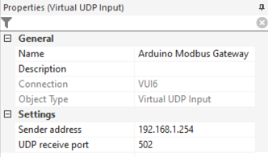

# Loxone and Modbus UDP protocol

Loxone Miniserver supports Modbus TCP protocol (Network Periphery > Add Network Device > **Modbus Server**). In addition, it can easily handle Modbus UDP protocol through standard **Virtual UDP output** and **Virtual UDP input**. It is a bit more complicated, because you need to assemble your Modbus UDP request manually and you also need to parse the Modbus UDP response. But it gives you more control over the process and allows you to bypass the 5 seconds poll interval restriction imposed by Loxone.

## Intro

First the difference between Modbus RTU and Modbus TCP/UDP messages.


(source: https://www.simplymodbus.ca/TCP.htm)

**Modbus RTU**
* It is used on the RS485 line which connect your Modbus device to the Arduino Modbus gateway.
* You can find the instructions on how to build the Modbus RTU message in the user manual (or data sheet) for the Modbus device you are using.

**Modbus TCP/UDP**
* It is used on the Ethernet line which connect the gateway to Loxone Miniserver.
* The Modbus TCP/UDP message is almost identical. You have 6 more bytes at the beginning, CRC (2 bytes) are missing at the end:
  - **Transaction ID**: 2 bytes set by the master (Loxone Miniserver) to uniquely identify each request. These bytes are echoed by the gateway since its responses may not be received in the same order as the requests.
  - **Protocol ID**: 2 bytes, always `00 00`
  - **Length**: 2 bytes identifying the number of bytes in the remainder of the message.
  - Unit ID (1 byte) = Slave ID
  - Function Code (1 byte) = Function Code
  - Data (n bytes) = Data
  - **CRC (2 bytes) is missing**

## Test

Consult the user manual (data sheet) for your Modbus device and send a test Modbus reguest through the web interface of the gateway (Modbus Status > Modbus RTU Request). If you plan to use multiple Modbus devices, I also recommend to change the slave ID of your device (check your user manual on how to do that). I have a Modbus humidity + temperature sensor, slave ID already set to 0x04, sending a Modbus RTU Request:

`04 04 00 01 00 02`

`04`: Slave ID<br>
`04`: Function Code (read input registers)<br>
`00 01`: Address of first register to read<br>
`00 02`: Number of registers to read. I am interested in 2 registers (temperature and humidity). You can ask for up to 123 registers in one request which is quite handy if you have devices with multiple sensors, energy meters with multiple channels, etc.
We do not need to calculate the CRC - the gateway will calculate and add the CRC itself.

Modbus RTU Response:

`04 04 04 00 C5 02 DF FE 41`

`04`: Slave ID (copy from request)<br>
`04`: Function Code (copy from request)<br>
`04`: Number of bytes of register values to follow (2 registers x 2 bytes per register)<br>
`00 C5`: Temperature HEX 00C5 = DEC 197 which means 19,7°C<br>
`02 DF`: Humidity HEX 02DF = DEC 735 which means 73,5 % relative humidity<br>
`FE 41`: CRC (does not interest us)

## Modbus UDP Request

Add your Arduino Modbus Gateway as **Virtual UDP Output** (see [tutorial](https://www.loxone.com/enen/kb/communication-with-udp/#ENTER%20THE%20ADDRESS)).  Use you gateway IP and UDP port for the address:

`/dev/udp/192.168.1.254/502`


Create new Modbus UDP request as **Virtual Output Command** with the following properties:


**Command for ON**: `\x00\x01\x00\x00\x00\x06\x04\x04\x00\x01\x00\x02`
The command is a Modbus TCP/UDP message, `\x` in Loxone syntax means we are sending the data as raw hex:

`00 01`: Transaction ID. Choose unique transaction ID for each request so that you can match requests and responses. You can use any value but it is a good idea to use the registry address as your transaction ID (thanks @smotek7 for the suggestion!)<br>
`00 00`: Protocol ID. Must be `00 00`<br>
`00 06`: Length. The number of bytes in the remainder of the message. Calculate it yourself.<br>
`04 04 00 01 00 02`: This is exactly the same Modbus RTU request (without CRC) we have tested earlier. It contains the slave ID, function code and data (which registers we are requested in).<br>
We do not have to calculate CRC in Loxone because there is no CRC in Modbus TCP/UDP messages.

**Repetition Interval [s]**: 
This is an interval for your Modbus request (poll). There are no limits, you can go as low as you want. But keep in mind that the RS485 line between the Modbus device and the gateway is quite slow half duplex -  therefore it is quite easy to choke up the line. I would not recommend going bellow 0,5 s.

**Use as Digital Output**: Enabled
The output is defined as digital. Now you need to your Virtual Output Command and place it into the Loxone Config plan and leave it there (without connection to any other block). Left click with mouse to the left end of the Virtual Output Command, small circle will appear. This means that the Virtual Output Command will be permanently ON and Loxone will send the Modbus UDP request at the specified Repetition Interval.


## Modbus UDP Response

In Loxone Config open the UDP Monitor and you will see Modbus UDP responses arriving. The response is the same we got earlier during our test in the gateway web UI (Modbus RTU Response), the only differences are additional 6 bytes at the beginning and missing CRC at the end:

`00 01 00 00 00 07 04 04 04 00 c5 02 df`

`00 01`: Transaction ID (copy from Modbus UDP request)<br>
`00 00`: Protocol ID.<br>
`00 07`: Length. The number of bytes in the remainder of the message.<br>
`04`: Slave ID (copy from request)<br>
`04`: Function Code (copy from request)<br>
`04`: Number of bytes of register values to follow (2 registers x 2 bytes per register)<br>
`00 C5`: Temperature<br>
`02 DF`: Humidity<br>

Now we need to parse the data. Create **Virtual UDP Input** (see the [tutorial](https://www.loxone.com/enen/kb/communication-with-udp/)), use the IP and UDP port of the gateway.



Add **Virtual UDP Input Command** for each sensor. In our case, we will use two Virtual UDP Input Commands (one for humidity, another one for temperature) to parse data from a single Modbus UDP response message.


**Command Recognition**: `\x00\x01\s4\x04\x04\s1\2\1`
This is the Loxone parser syntax (see [this blog post](https://sarnau.info/loxone-udp-http-command-parser-syntax/) for a comprehensive overview). Here is what the command mean:
`\x00\x01`: Validate transaction ID. Use the same as in the request.<br>
`\s4`: Skip 4 bytes (protocol ID, length)<br>
`\x04`: Validate Slave ID (the same as in the request)<br>
`\x04`: Validate Function code (same as in the request), check against Modbus exception codes (in case of an error, the gateway returns Function code increased by 0xB0)<br>
`\s1`: Skip one byte (number of bytes of register values to follow)<br>
`\2\1`: Parse the value (temperature)

We parse the values by individual bytes. `\1`…`\8` stores the respective byte as part of a 64-bit binary integer result. `\1` is the LSB, `\8` is the MSB. The logic is quite simple:
* byte: `\1`
* 16-bit integer (in 1 register): `\2\1`
* 32-bit integer (in 2 registers, low 16 bits in the first register, high 16 bits in the second register): `\2\1\4\3`
* 16-bit integer little endian (in 1 register): `\1\2`
* etc.
* 32-bit float is more complicated:
  - parse as signed 32-bit integer using `\1`, `\2`, `\3` and `\4` in the correct order
  - enable Signed Values
  - in Loxone Config convert the signed 32-bit integer to float with 2 formulas:


formula 1:
```
IF(I1>=0;I1;((I1*-1)-(2^31))*-1)
```
formula 2:
```
(((((I1-INT(I1/2^23)*2^23)-(I1-INT(I1/2^0)*2^0))/2^0)+2^23)/(2^(23-((((I1-INT(I1/2^31)*2^31)-(I1-INT(I1/2^23)*2^23))/2^23)-127))))*IF(I2>=0;1;-1)
```
**Signed Values**: Enable/Disable for signed/unsigned data type.

**Correction**: Allows you do simple math operations + = * / with the parsed number. In our case, we are dividing the value by 10, so that we get 197 => 19,7

Add **Virtual UDP Input Command** for the second sensor (humidity). We are parsing the same Modbus UDP response which contains a 16-bit register (2 bytes) for temperature and a 16-bit register (2 bytes) for humidity. **Command Recognition** is very similar, we only need to skip 2 more bytes (where temperature is stored). In order to get humidity we have changed `\s1` to `\s3`: `\x00\x01\s4\x04\x04\s3\2\1`. If you have more sensors in the 

Here is the result:

## Errors

In case of an error, the Modbus device (or the gateway) responds with a message where the function code is increased by 0x80 and the next byte is the exception code (see [wiki](https://en.wikipedia.org/wiki/Modbus#Exception_responses)). In Modbus UDP, function code is the 8th byte, exception code is the 9th byte:

