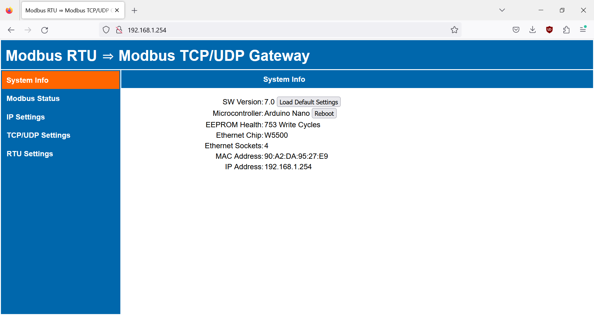
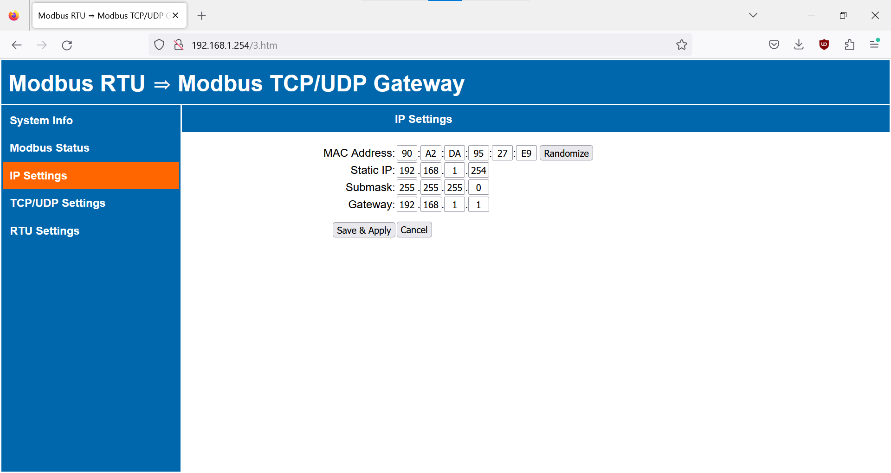

# Modbus RTU ⇒ Modbus TCP/UDP Gateway
Arduino-based Modbus RTU to Modbus TCP/UDP gateway with web interface. Allows you to connect Modbus RTU slaves (such as sensors, energy meters, HVAC devices) to Modbus TCP/UDP masters (such as home automation systems). You can adjust settings through web interface.

* [What is it good for?](#what-is-it-good-for)
* [Technical specifications](#technical-specifications)
* [Hardware](#hardware)
* [Firmware](#firmware)
* [Settings](#settings)
  - [System Info](#system-info)
  - [Modbus Status](#modbus-status)
  - [IP Settings](#ip-settings)
  - [TCP/UDP Settings](#tcpudp-settings)
  - [RTU Settings](#rtu-settings)
  - [Tools](#tools)
* [Integration](#integration)
  - [Loxone](#loxone)
  - [Home Assistant](#home-assistant)
  - [OpenHAB](#openhab)
  - [Node-RED](#node-red)
* [Limitations and Known Issues](#limitations-and-known-issues)
* [Links and Credits](#links-and-credits)
* [Version History](#version-history)

# What is it good for?

Allows you to connect your Modbus devices (such as sensors, energy meters, HVAC devices) to monitoring systems and home automation systems (such as Loxone, Home Assistant, OpenHAB and other). You do not need commercial Modbus gateways. Arduino (with an ethernet shield and a cheap TTL to RS485 module) can do the job! You can easily change settings of your Arduino Modbus gateway via web interface, your settings are automatically stored in EEPROM.

# Technical specifications

* slaves are connected via RS485 interface:
  - up to 247 Modbus RTU slaves
* master(s) are connected via ethernet interface:
  - up to 6 Modbus TCP masters (depending on hardware)
  - unlimited number of Modbus UDP masters
* RS485 interface protocols:
  - Modbus RTU
* ethernet interface protocols:
  - Modbus TCP
  - Modbus UDP
  - Modbus RTU over TCP
  - Modbus RTU over UDP
* supports broadcast (slave address 0x00)
* supports all Modbus function codes
* supports error codes:
  - codes 1~8 are forwarded from slaves
  - codes 10, 11 are generated by the gateway
* diagnostics via web interface:
  - send Modbus request and recieve Modbus response
  - scan Modbus slaves on RS485 interface
  - queue (buffer) status
  - counters ("RTU Data", "Ethernet Data", "Modbus Statistics") are periodically saved to EEPROM (every 6 hours)
  - unsigned longs are used, rollover of counters is synchronized
  - content of the Modbus Status page is updated in the background (fetch API), javascript alert is shown if connection is lost
* optimized TCP socket management (web interface and Modbus TCP):
  - gateway always listens for new web and Modbus TCP connections
  - existing connections are kept alive (persistent), unless the gateway runs out of available sockets
  - if there are no available sockets, oldest connections are closed after they are idle for a certain time, Modbus TCP idle timeout is configured in user settings (web UI), webserver idle timeout is configured in advanced settings (sketch)
* optimized queue (buffer) for Modbus requests:
  - queue will accept only one requests to a non-responding slave
  - requests to responding slaves are prioritized over requests to non-responding slaves
  - queue size configured in advanced settings (sketch)
* user settings:
  - can be changed via web interface (see screenshots bellow)
  - stored in EEPROM
  - retained during firmware upgrade (only in case of major version change, Arduino loads factory defaults)
  - all web interface inputs have proper validation
  - factory defaults for user settings can be specified in advanced_settings.h
  - settings marked \* are only available if ENABLE_DHCP is defined in the sketch
  - settings marked \*\* are only available if ENABLE_EXTRA_DIAG is defined in the sketch
* advanced settings:
  - can be changed in sketch (advanced_settings.h)
  - stored in flash memory

# Hardware
Get the hardware (cheap clones from China are sufficient) and connect together:

* **Arduino Nano, Uno or Mega** (and possibly other boards with ATmega chips). On Mega you have to configure Serial in advanced settings in the sketch.
* **Ethernet shield with WIZnet chip (W5100, W5200 or W5500)**. The ubiquitous W5100 shield for Uno/Mega is sufficient. If available, I recommend W5500 Ethernet Shield. You can also use combo board MCU + ethernet (such as ATmega328 + W5500 board from Keyestudio). ATTENTION: Ethernet shields with ENC28J60 chip will not work !!!
* **TTL to RS485 module with an automatic flow direction control**. You can buy cheap modules with MAX3485, MAX13487, SP485 or SP3485 chips (some of these modules are branded as "XY-017", "XY-485", "XY-G485", etc.) from Aliexpress and other marketplaces. ATTENTION: Modules with MAX485 chip will work (use pin 6 for DE+RE), but are NOT recommended (no auto-direction, no ESD protection, no hot-swap protection) !!!
* **External power supply**. Use regulated 5V external power supply for both the Arduino (+ the ethernet shield) and the RS485 module. ATTENTION: By using the 5V pin, you are bypassing Arduino's built-in voltage regulator and reverse-polarity protection curcuit. Make sure your external power supply does not exceed 5,5V !!!

Here is my HW setup:
Terminal shield + Arduino Nano + W5500 ethernet shield (from RobotDyn, no longer available) + TTL to RS485 module (automatic flow control)

# Firmware

You can either:
- **Download and flash my pre-compiled firmware** from "Releases".
- **Compile your own firmware**. Download this repository (all *.ino files) and open arduino-modbus-rtu-tcp-gateway.ino in Arduino IDE. If you want, you can check advanced_settings.h for advanced settings (can only be changed in the sketch) and for default factory settings (can be later changed via web interface). Download all required libraries, compile and upload your program to Arduino. The program uses the following external libraries (all are available in Arduino IDE's "library manager"):
 - CircularBuffer (https://github.com/rlogiacco/CircularBuffer)
 - StreamLib (https://github.com/jandrassy/StreamLib)

Connect your Arduino to ethernet and use your web browser to access the web interface on default IP:  http://192.168.1.254
Enjoy :-)
# Settings
  - settings marked \* are only available if ENABLE_DHCP is defined in the sketch
  - settings marked \*\* are only available if ENABLE_EXTRA_DIAG is defined in the sketch

## System Info

**EEPROM Health**. Keeps track of EEPROM write cycles (this counter is persistent, never cleared during factory resets). Replace your Arduino once you reach 100 000 write cycles (with 6 hours EEPROM_INTERVAL you have more than 50 years lifespan).

**Ethernet Sockets**. Max number of usable sockets. See Limitations bellow. One socket is reserved for Modbus UDP, remaining sockets are shared between Modbus TCP and WebUI.

**Ethernet Chip**. Wiznet chip on the ethernet shield.

**MAC Address**. First 3 bytes are fixed 90:A2:DA, remaining 3 bytes are random. You can also set manual MAC in IP Settings.

## Modbus Status

**Modbus RTU Request**. Send a Modbus RTU request directly from web UI. First byte (slave address) and second byte (function code) are mandatory, no need to calculate CRC. Gateway remembers last request for your convenience.

**Modbus RTU Response**. Shows response to the last Modbus request. Response is shown in Modbus RTU format (incl. CRC). Due to memory limitations, only few initial bytes are shown.

**Run Time**.\*\* Days, hours, minutes and seconds since boot or stat reset.

**RTU Data**.\*\* Counter for bytes sent and received via RS485.

**Ethernet Data**.\*\* Counter for bytes sent and received via Modbus TCP/UDP.

**Requests Queue**. Monitors internal request queue (buffer). The limits for bytes and for the number of requests stored in the queue can be configured in advanced settings.

**Modbus Statistics**.
* **Slave Responded**. Slave responded with a valid Modbus RTU response within response timeout.
* **Slave Responded with Error (Codes 1~8)**. Slave responded, but with an error. For the list of error codes see [Wikipedia](https://en.wikipedia.org/wiki/Modbus#Exception_responses).
* **Gateway Overloaded (Code 10)**. Request queue is full (either the number of bytes stored or the number of requests stored). Request was dropped and the gateway responded with an error code 10.
* **Slave Failed to Respond (Code 11)**. Slave is not responding. Response timeouts have passed, all attempts have failed. The gateway responded with an error code 11.
* **Invalid TCP/UDP Request**. Invalid request was received via TCP or UDP. Request was dropped, no response was sent by the gateway. Validation criteria depends on the Modbus mode:
  - Modbus TCP/UDP: MBAP header (protocol identifier is 0x0000, length is < 255 and corresponds to the number of bytes in the remainder of the Modbus request)
  - Modbus RTU over TCP/UDP: CRC ckeck
* **Invalid RTU Response**. Invalid data were recieved via RS485. Could be caused by wrong Modbus RTU settings, short response timeout (any response arriving after timeout is invalid) or Arduino delays in processing the response. Validation criteria:
  - silence between individual bytes is shorter than char timeout specified in Modbus RTU standards
  - CRC check
  - slave address in the Modbus RTU response corresponds to the slave address in the request
  - response arrived before response timeout
* **Response Timeout**. Slave failed to respond within the specified response timeout. New attempt follows (or error code 11 if all attempts were spent).

**Modbus Masters**. Shows IP addresses for Modbus TCP or UDP masters:
* **UDP**. Only the last Modbus UDP master is shown, because all UDP masters connect to the same socket.
* **TCP**. All connected Modbus TCP masters are shown. Each Modbus TCP connection occupies one socket.

**Modbus Slaves**. Shows the slave address (in hex) and the last status (error) for all slaves who responded to a slave scan or who were recipients of a Modbus request.

**Scan Slaves**. An attempt is made to find Modbus RTU slaves connected to the RS485 interface:
  - scan is launched automaticaly after boot or manualy
  - scans all slave addresses 1 - 247
  - dummy requests are sent to each slave address for two different Modbus functions (configured in advanced settings)
  - fixed response timeout (very short, configured in advanced settings), only one attempt
  - gateway marks the slave as "Slave Responded" if any response is sent by the slave (even error)

## IP Settings

**MAC Address**. Change MAC address. "Randomize" button will generate new random MAC (first 3 bytes fixed 90:A2:DA, last 3 bytes will be random).

**Auto IP**.\* Once enabled, Arduino will receive IP, gateway, subnet and DNS from the DHCP server.

**Static IP**. Set new static IP address. Gateway automatically redirect the web interface to the new IP.

**Submask**.

**Gateway**.

**DNS**.\*

## TCP/UDP Settings

**Modbus TCP Port**.

**Modbus UDP Port**. Can be the same as Modbus TCP Port.

**Web Port**. Gateway automatically redirect the web interface to the new Web UI port.

**Modbus Mode**. Modbus TCP/UDP or Modbus RTU over TCP/UDP. Be aware that "Modbus RTU over TCP/UDP" is not a standard Modbus protocol. In this mode, the gateway expects to recieve Modbus RTU request (incl. CRC) via TCP or UDP. Responses from RS485 line are forwarded as they are in Modbus RTU format (incl. CRC).

**Modbus TCP Idle Timeout**. Amount of time that a connection is always held alive (open) with no incoming traffic from a Modbus TCP master. This timeout should be longer than polling period (scan rate) set on your Modbus TCP master device.

## RTU Settings

**Baud Rate**. Choose baud rate from a pre-aranged list. The list can be adjusted in advanced settings.

**Data Bits**. Data bits available on arduino HW serial line: 5, 6, 7, 8.

**Parity**. Parity options available on arduino HW serial line: None, Even, Odd.

**Stop Bits**. 1 or 2 stop bits.

**Inter-frame Delay**. Delay (ms) between the end of reading Modbus RTU frame and writing new frame. Higher Frame Delay is needed for RS485 modules with automatic flow control. Increase Frame Delay if you have very short polling period and Response Timeouts in stats. The minimum Inter-frame Delay is calculated from baud rate according to Modbus standards.

**Response Timeout**. Timeout for Modbus RTU response. Increase Response Timeout if you see Response Timeouts in Modbus statistics.

**Attempts**. Number of attempts before error (Code 11) is sent back to the Modbus TCP/UDP master.

## Tools

**Load Default Settings**. Loads default settings (see DEFAULT_CONFIG in advanced settings). MAC address is retained.

**Reboot**.

# Integration

This gateway adheres to the Modbus protocol specifications, so you can use it to connect any compliant Modbus RTU slave (Modbus device) with any compliant Modbus  TCP/UDP master (such as home automation system). Here is a quick overview how you can integrate the gateway into the most popular home automation systems:

## Loxone

Loxone Miniserver (both the current Miniserver and the old Miniserver Gen. 1) supports:
* Modbus TCP (through **Modbus Server**)
* Modbus UDP (through **Virtual UDP output** and **Virtual UDP input**)

**Modbus TCP**. You can use this Arduino Modbus gateway as a fully-fledged replacement of the Loxone Modbus Extension. In Loxone Config, go to Network Perifery > Add Network Device > Modbus Server. Specify IP and port of your gateway. Timeout [ms] should be longer than Response Timeout set in the gateway.

In the next step, add individual Modbus devices. Adding and configuring Modbus devices connected to your Arduino Modbus gateway ("Modbus Server" in Loxone Config) is identical to configuring devices connected through Loxone Modbus Extension. You can either:
* download **Device Template** from the **[Loxone Library](https://library.loxone.com/)** (there are already hundreds of templates for various Modbus devices)
* manually add your device following this **[official tutorial](https://www.loxone.com/enen/kb/communication-with-modbus/)**.

Please note that the implementation of Modbus RTU (= Loxone Modbus Extension) and Modbus TCP (= Arduino Modbus gateway connected as "Modbus Server") in Loxone has some restrictions:
* ~~Miniserver can not poll your Modbus sensors faster than 5 seconds. This is a deliberate restriction imposed by Loxone.~~ **Fixed in Loxone Config 14.4.9.25**. Minimum polling-cycle reduced to 1s (except Air-Devices), up to 2 Sensors per Modbus-Server or Extension allow a minimum time of 0.1s.
* Miniserver can not poll multiple Modbus registers at once. If you have multiple sensors on the device, Loxone will send a separate requests for each of them even if you have identical poll intervals for these sensors. This is a design flaw by Loxone.

**Modbus UDP**. If you want to avoid the above mentioned limitations, you can use Modbus UDP as a communication protocol between Loxone and this Arduino Modbus gateway. See [Loxone_ModbusUDP.md](Loxone_ModbusUDP.md) on how to implement Modbus UDP in Loxone with **Virtual UDP output** and **Virtual UDP input**.

## Home Assistant

Supports Modbus TCP, Modbus UDP, Modbus RTU over TCP. Follow this **[official tutorial](https://www.home-assistant.io/integrations/modbus/)**.

## OpenHAB

Supports Modbus TCP. Follow this **[official tutorial](https://www.openhab.org/addons/bindings/modbus/)**.

## Node-RED

Supports Modbus TCP. Import and configure the **[node-red-contrib-modbus](https://flows.nodered.org/node/node-red-contrib-modbus)** package. You can use Node RED as:
* a rudimentary automation system on its own
* an intermediary between the Modbus gateway and other home automation system
* an intermediary between the Modbus gateway and a time series database and visualisation tool (InfluxDB + Grafana)

# Limitations and Known Issues

## Portability

The code was tested on Arduino Nano, Uno and Mega, ethernet chips W5100 and W5500. It may work on other platforms, but:

* The random number generator (for random MAC) is seeded through watch dog timer interrupt - this will work only on Arduino (credits to https://sites.google.com/site/astudyofentropy/project-definition/timer-jitter-entropy-sources/entropy-library/arduino-random-seed)
* The restart function will also work only on Arduino.

## Ethernet sockets

The number of used sockets is determined (by the Ethernet.h library) based on microcontroller RAM. Therefore, even if you use W5500 (which has 8 sockets available) on Arduino Nano, only 4 sockets will be used due to limited RAM on Nano.

## Memory

Not everything could fit into the limited flash memory of Arduino Nano / Uno. If you have a microcontroller with more memory (such as Mega), you can enable extra settings in the main sketch by defining ENABLE_DHCP and/or ENABLE_EXTRA_DIAG in advanced settings.

# Links and Credits

https://en.wikipedia.org/wiki/Modbus

https://modbus.org/specs.php

http://www.simplymodbus.ca/FAQ.htm

https://github.com/jandrassy/StreamLib

https://werner.rothschopf.net/202003_arduino_webserver_post_en.htm

Big thanks to the authors of these libraries and tutorials!

# Version History

For version history see [arduino-modbus-rtu-tcp-gateway.ino](arduino-modbus-rtu-tcp-gateway/arduino-modbus-rtu-tcp-gateway.ino#L3)
